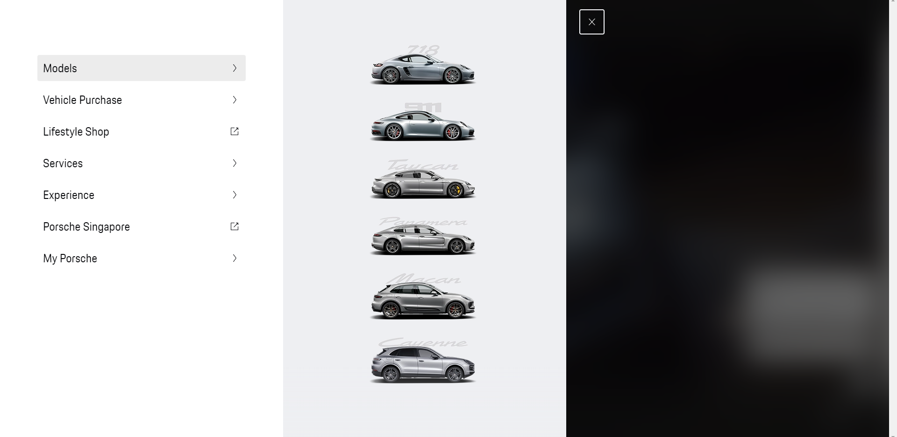
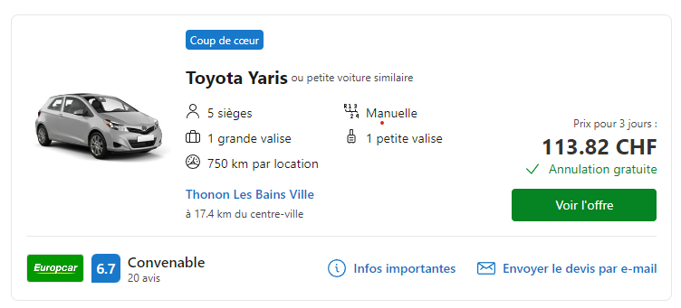
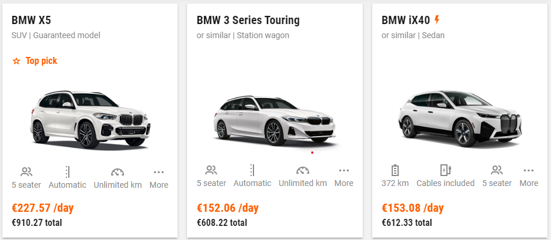
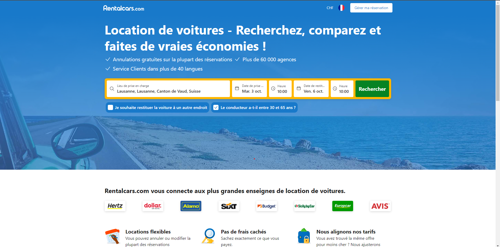
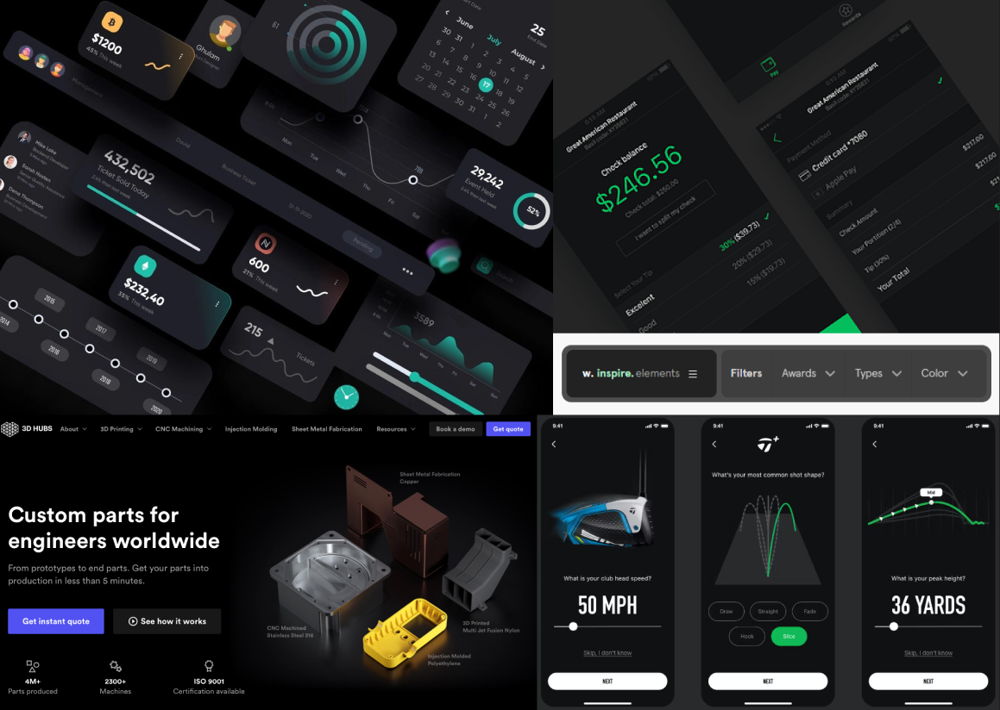

# Functional analysis
### Porsche
On the [official posrche website](https://finder.porsche.com/ch/fr-CH?gclid=CjwKCAjwyNSoBhA9EiwA5aYlb28uEKycYvB0vpEDF3Gu1KIwBWsxkAJ-afVjWSdgDLyJFixClk_l1BoCfngQAvD_BwE) you'll find a menu that opens from the left. What's interesting here is that the cars are sorted first by type/model (718, 911, etc...) and then, once a model has been chosen, by release.

### Car cards
On the [RentalCars](https://www.rentalcars.com/fr/) and [sixt](https://www.sixt.com/) sites, after launching a search, the cars are presented with a list of cards. These cards are interesting because they give you a lot of information about the car you want to rent at a glance.

### Search by location
On the [rentalCar](https://www.rentalcars.com/fr/) home page, you'll also find a search bar for selecting a location. This search will allow the application to provide the user with all vehicles for rent within a certain perimeter around the location.

# Graphic analysis

*The choices below have been made to keep with Porsche's style.*

### Fonts
### Fonts
* [Primary](https://fontspace.io/porsche-font/)
* [Secondary (PorscheNext-Regular Regular Version 2.000)](https://eng.m.fontke.com/family/1324315/style/Bold/)

### Color palette

**Réfèrences** :
* [Red](https://exoticcarcolors.com/car-color/carmine-red/)
* [Yellow](https://exoticcarcolors.com/car-color/racing-yellow/)
* [Gray](https://exoticcarcolors.com/car-color/gt-silver-metallic/)

### Moodboard

[view on Figma](https://www.figma.com/file/etwfdM6xGwv18faEdUP76g/RaP---moodboard?type=design&node-id=0-1&mode=design&t=lSLBaXGolnVkQ8a1-0)

# Technical analysis 

*Technologies & tools*

In order to benefit from the tools provided by a framework, I decided to turn to React js. In particular, it will enable me to easily set up a router for my pages, and has the advantage of benefiting from UI libraries such as React Aria or next UI.

As far as css is concerned, Tailwind seems to be the best solution. It will allow me to be more efficient when writing css, to set my colors and eventually benefit from tailwind UI while giving me great freedom in the design and clean css code.
