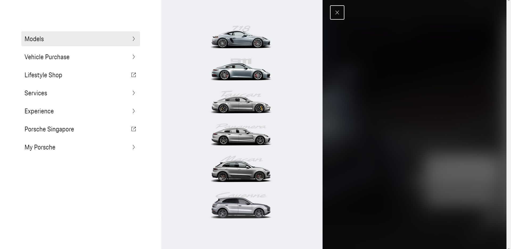
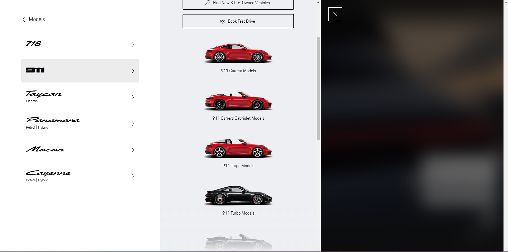
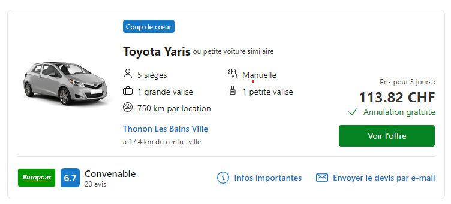
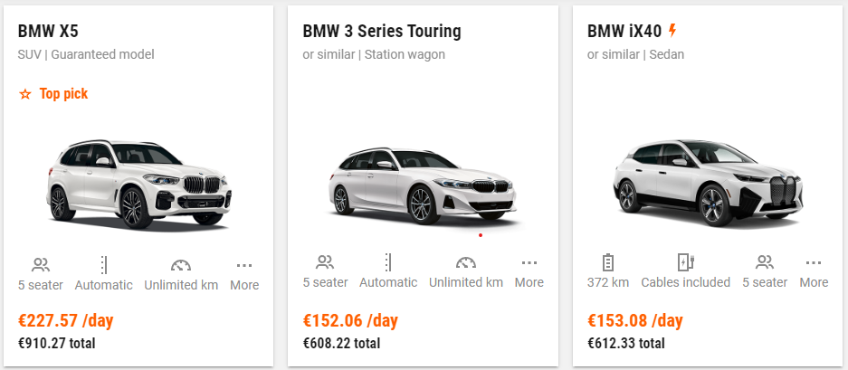
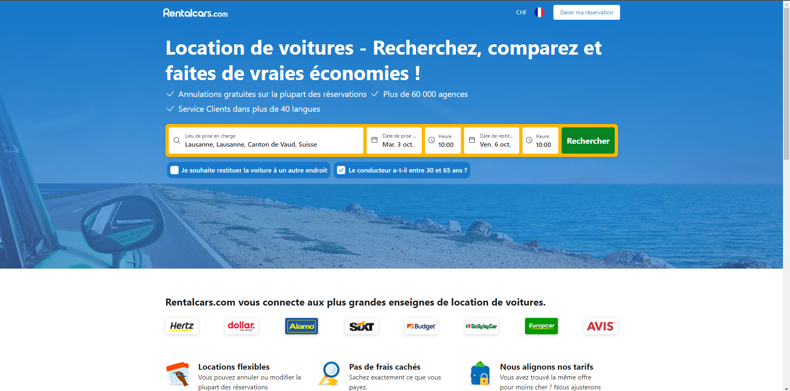
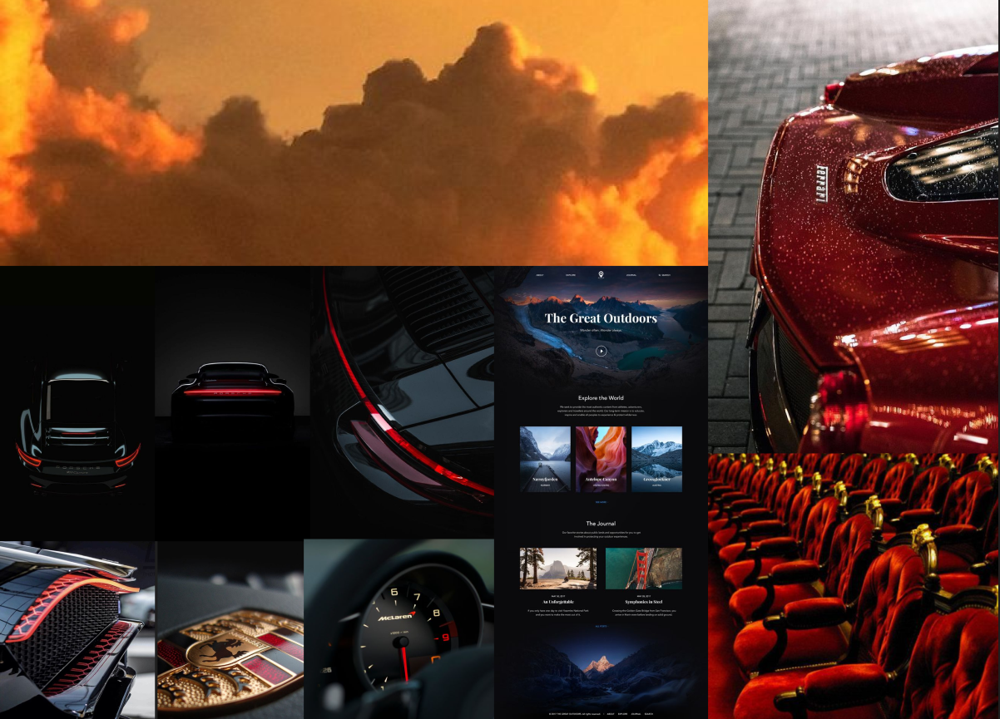

# Analyse fonctionnelle
### Porsche
Sur le [site officiel de posrche](https://finder.porsche.com/ch/fr-CH?gclid=CjwKCAjwyNSoBhA9EiwA5aYlb28uEKycYvB0vpEDF3Gu1KIwBWsxkAJ-afVjWSdgDLyJFixClk_l1BoCfngQAvD_BwE) on retrouve un menu qui s'ouvre en volet partant de la gauche. Ce qui est interessant ici c'est de voir que les voitures sont triées dans un premier temps par type/modèles (718, 911, etc...) puis, une fois un modèle choisi, par release.

### Cartes de voitures
Sur les sites de [RentalCars](https://www.rentalcars.com/fr/) et de [sixt](https://www.sixt.com/), après avoir lancé une recherche, les voitures sont présentées avec une liste de cartes. Ces cartes sont intéressantes car elles permettent d'avoir beaucoup d'information concernant le vehicule a louer du premier coup d'oeil.

### Recherche par lieu
Sur le site de [rentalCar](https://www.rentalcars.com/fr/) on retrouve aussi sur la page d'accueil, une barre de recherche pour séléctionner un lieu. Cette recherche permmettra à l'application de fournir à l'utilisateur tous les vehicules à louer dans un certain perimettre autour du lieu.

# Analyse graphique

*Les choix ci-dessous ont été faits pour rester dans le style de Porsche.*

### Fonts
* [Primaire](https://fontspace.io/porsche-font/)
* [Secondaire (PorscheNext-Regular Regular Version 2.000)](https://eng.m.fontke.com/family/1324315/style/Bold/)

### Palette de couleurs

**Réfèrences** :
* [Rouge](https://exoticcarcolors.com/car-color/carmine-red/)
* [Jaune](https://exoticcarcolors.com/car-color/racing-yellow/)
* [Gris](https://exoticcarcolors.com/car-color/gt-silver-metallic/)

### Moodboard

[voir sur Figma](https://www.figma.com/file/etwfdM6xGwv18faEdUP76g/RaP---moodboard?type=design&node-id=0-1&mode=design&t=lSLBaXGolnVkQ8a1-0)

# Analyse technique 

*Technologies & outils*

Afin de bénéficier des outils mis à disposition par un framework, j'ai décidé de me tourner vers React js. Celui-ci me permettra notamment d'avoir facilement un router pour mes pages et a l'avantage de bénéficier d'un tas de librairies UI telles que React Aria ou next UI.

En ce qui concerne le css, Tailwind semble être la meilleure des solutions. Il me permettra d'être plus efficace lors de l'écriture du css, de parametrer mes couleurs et eventuellement bénéficier de tailwind UI tout en me laissant une grande liberté dans le design et du code css épuré.
