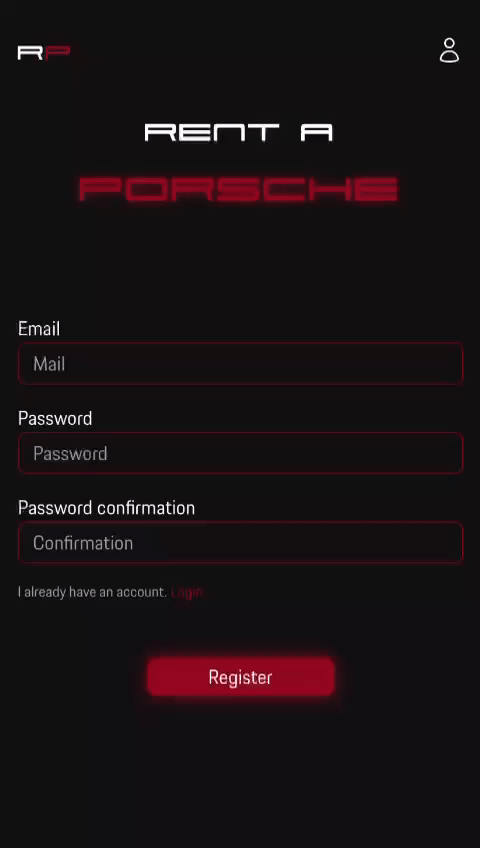
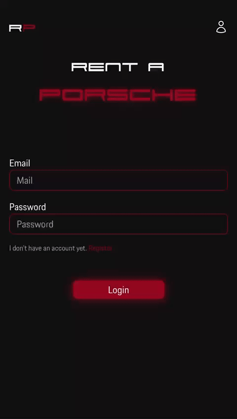

# Maquettes

Vous pouvez visualiser le design de l'application sur [figma](https://www.figma.com/file/P0TBPjOzcI4tStCMmu7rLL/Rent-a-Porsche?type=design&node-id=0-1&mode=design&t=H5ye6W0xJBUDFohK-0) ou bien depuis l'application proto pour avoir un rendu realiste en utilisant le lien suivant : https://www.figma.com/proto/P0TBPjOzcI4tStCMmu7rLL/Rent-a-Porsche?type=design&node-id=1-3&t=5efIahimiUDIUmzj-0&scaling=scale-down&page-id=0%3A1.

## Navigation

Depuis [figma](https://www.figma.com/file/P0TBPjOzcI4tStCMmu7rLL/Rent-a-Porsche?type=design&node-id=0-1&mode=design&t=H5ye6W0xJBUDFohK-0), vous pouvez utiliser le volet de droite et cliquer sur "Prototype" afin d'avoir une vue d'ensemble sur la navigation entre les pages.

Notez que pour être plus cohérant avec le cahier des charges, une interface administrateur à été ajoutée afin d'ajouter plus de contenu (formulaire notamment). De fait, lorsque l'on effectur un clique sur le bouton "login" de la page "Login-mobile" celui affiche la page home comme si l'utilisateur s'etait log en admin. 

## Design et couleurs

Conformement à l'analyse, la palette de couleur suivant à été respctée dans le design.

[


](https://coolors.co/000000-a3acb3-f4f4f4-9d0620-f8cd02)

L'application ayant un thème sombre, la première couleur de contraste est le rouge et est souvent utilisé avec des ombres de même couleur afin d'évoquer la signature de la marque Porsche de par ses célèbres phares leds.


Le jaune est quand à lui utilisé comme seconde couleur de contraste pour mettre en avant les composant ayant des utilités spécifiques ainsi que toute l'interface administrateurs.


# Code

Toutes les vues n'ont pas été codée.
Sont visualisables :
* Home (admin ou non) 
* Login
* Register 
* New car
* Account
* Searche (location et vehicule)

## Structure

Les routes se trouvent a la racine dans le fichier "App.jsx". Celui-ci determine quelle vue sera rendu à l'utilisateur.

Les vues se trouvent toutes dans src/pages et font références a de composants dans src/components. 

Comme je savais que dans mes designs beaucoup de mes composants se répétaient, j'ai décidé de mettre à profit React en créant des "reusable components" en gagnant du temps et de la legereté sur mon code. 

## Navigation
### Admin
De la même manière que sur la maquette, les formulaires ne sont pas fonctionnels (sauf la recherche de vehicule). De fait, lorsque que vous cliquerez sur le bouton login de la page login, vous serez automatiquement commecté en tant qu'administrateur.

Une fois connecté, l'icon "user" en haut a droite de l'écran permet d'acceder au profil de l'utilisateur. Depuis cette vue vous pourrez vous déconnecter au besoin. 

### href ?
Si vous vous attardez un peu sur le code, vous remarquerez que pour la navigation j'utilise des balises `<a></a>` sans href. La navigation est faite grace à l'option `onClick` sur les balises avec un hook `useNavigate`. J'ai fait ce choix car en utilisant `href` cela provoque un reload inutile du site (cela prolonge la transition entre les pages et fait un flash blanc sur mobile.) là où `useNavigate` change la route sans avoir à tout recharger.

\<a href="/login">|\<a onClick={navigate("/register")}>
:-------------------------:|:-------------------------:
 |


## Responsive

L'application a été codée de manière à être utiliser sur mobile. Bien que dans les grandes lignes il ne devrait pas y avoir de problème de visualisation sur des écrans larges, il est fprt possible que l'experience ne soit pas optimale.

Une grande majorité des éléments de l'application utilisent des flexbox ou des grids.
```html
 <div className='flex justify-between items-text-Porsche-gray'>
```
```html
<div className='grid grid-cols-1 gap-6'>
```
